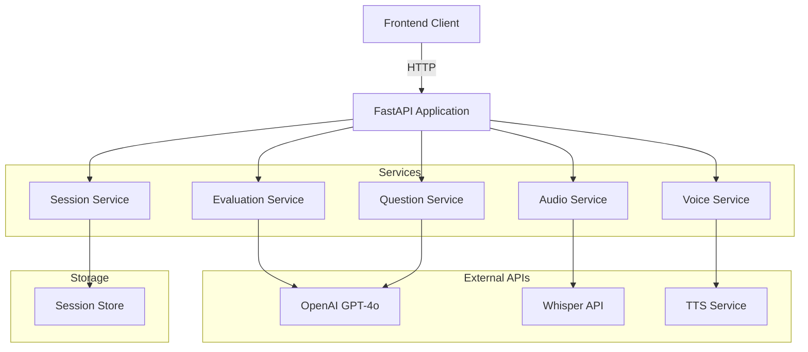
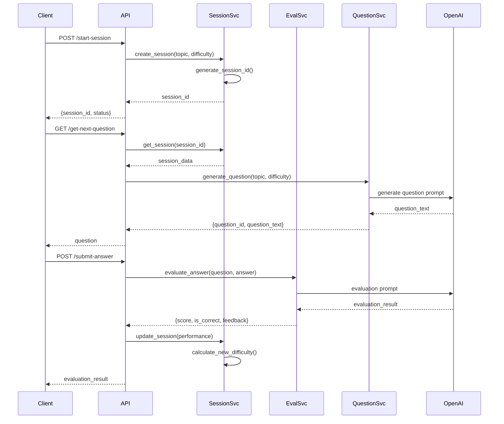

# Design Document: AI Assessment Backend

## Overview

The AI Assessment Backend is a FastAPI-based REST API service that provides intelligent evaluation and adaptive question generation for educational assessments. The system integrates with OpenAI's GPT-4o for answer evaluation and question generation, Whisper API for audio transcription, and text-to-speech services for voice feedback.

The architecture follows a modular design with clear separation of concerns:
- **API Layer**: FastAPI endpoints handling HTTP requests/responses
- **Service Layer**: Business logic for evaluation, session management, and adaptation
- **Integration Layer**: External API clients for OpenAI, Whisper, and TTS services
- **Data Layer**: Session state management and persistence

## Architecture

### High-Level Architecture



### Component Interaction Flow



## Components and Interfaces

### 1. API Layer (FastAPI Endpoints)

**Endpoints:**

```python
POST /start-session
Request: {topic: str, initial_difficulty: str}
Response: {session_id: str, status: str}

GET /get-next-question?session_id={uuid}
Response: {question_id: str, question_text: str, difficulty: str}

POST /submit-answer
Request: {session_id: str, question_id: str, answer_text: str}
Response: {score: int, is_correct: bool, feedback_text: str, new_difficulty: str}

POST /transcribe-audio
Request: FormData with audio file
Response: {transcribed_text: str}

POST /generate-voice-feedback
Request: {feedback_text: str}
Response: Audio stream or {audio_url: str}
```

### 2. Session Service

**Responsibilities:**
- Create and manage assessment sessions
- Track student performance history
- Calculate adaptive difficulty adjustments
- Persist and retrieve session state

**Interface:**

```python
class SessionService:
    def create_session(topic: str, initial_difficulty: Difficulty) -> str
    def get_session(session_id: str) -> Session
    def update_session_performance(session_id: str, score: int, is_correct: bool) -> None
    def calculate_new_difficulty(session_id: str) -> Difficulty
    def get_current_difficulty(session_id: str) -> Difficulty
```

**Adaptive Logic:**
- Maintains a sliding window of the last 2 question results
- Tracks consecutive correct/incorrect answers at each difficulty level
- Applies difficulty adjustment rules based on performance patterns

### 3. Evaluation Service

**Responsibilities:**
- Evaluate student answers using GPT-4o
- Parse and structure AI responses
- Determine correctness based on score threshold

**Interface:**

```python
class EvaluationService:
    def evaluate_answer(question: str, answer: str, topic: str) -> EvaluationResult
    def _build_evaluation_prompt(question: str, answer: str, topic: str) -> str
    def _parse_evaluation_response(response: str) -> EvaluationResult
```

**Evaluation Prompt Structure:**
```
You are an expert educator evaluating a student's answer.

Topic: {topic}
Question: {question}
Student Answer: {answer}

Evaluate the answer and provide:
1. A score from 0-100
2. Whether the answer is correct (score >= 80)
3. Constructive feedback explaining what was correct/incorrect
4. Suggested difficulty for next question (Easy/Medium/Hard)

Return your response as JSON with this exact structure:
{
  "score": <int>,
  "is_correct": <bool>,
  "feedback_text": "<string>",
  "suggested_difficulty": "<Easy|Medium|Hard>"
}
```

### 4. Question Service

**Responsibilities:**
- Generate questions using GPT-4o
- Ensure questions match specified difficulty and topic
- Assign unique question IDs

**Interface:**

```python
class QuestionService:
    def generate_question(topic: str, difficulty: Difficulty) -> Question
    def _build_question_prompt(topic: str, difficulty: Difficulty) -> str
```

**Question Generation Prompt Structure:**
```
Generate a {difficulty} level question about {topic}.

Difficulty Guidelines:
- Easy: Basic concepts, definitions, recall
- Medium: Application, analysis, understanding relationships
- Hard: Complex problem-solving, synthesis, evaluation

Return only the question text, no additional formatting.
```

### 5. Audio Service

**Responsibilities:**
- Transcribe audio files using Whisper API
- Validate audio file formats and sizes
- Handle audio processing errors

**Interface:**

```python
class AudioService:
    def transcribe_audio(audio_file: UploadFile) -> str
    def _validate_audio_file(audio_file: UploadFile) -> bool
```

**Supported Formats:** mp3, mp4, mpeg, mpga, m4a, wav, webm

### 6. Voice Service

**Responsibilities:**
- Convert feedback text to audio using TTS
- Stream or return audio URLs
- Handle TTS API errors

**Interface:**

```python
class VoiceService:
    def generate_voice_feedback(feedback_text: str) -> AudioResponse
    def _call_tts_api(text: str) -> bytes
```

### 7. OpenAI Client

**Responsibilities:**
- Manage OpenAI API authentication
- Handle API rate limiting and retries
- Provide unified interface for GPT-4o calls

**Interface:**

```python
class OpenAIClient:
    def chat_completion(messages: List[Dict], response_format: str = "json") -> str
    def _handle_api_error(error: Exception) -> None
```

## Data Models

### Session Model

```python
class Difficulty(str, Enum):
    EASY = "Easy"
    MEDIUM = "Medium"
    HARD = "Hard"

class PerformanceRecord:
    question_id: str
    score: int
    is_correct: bool
    difficulty: Difficulty
    timestamp: datetime

class Session:
    session_id: str  # UUID
    topic: str
    current_difficulty: Difficulty
    performance_history: List[PerformanceRecord]
    created_at: datetime
    updated_at: datetime
```

### Evaluation Result Model

```python
class EvaluationResult:
    score: int  # 0-100
    is_correct: bool
    feedback_text: str
    suggested_difficulty: Difficulty
```

### Question Model

```python
class Question:
    question_id: str  # UUID
    question_text: str
    difficulty: Difficulty
    topic: str
    created_at: datetime
```

### API Request/Response Models

```python
class StartSessionRequest(BaseModel):
    topic: str
    initial_difficulty: Difficulty

class StartSessionResponse(BaseModel):
    session_id: str
    status: str

class SubmitAnswerRequest(BaseModel):
    session_id: str
    question_id: str
    answer_text: str

class SubmitAnswerResponse(BaseModel):
    score: int
    is_correct: bool
    feedback_text: str
    new_difficulty: Difficulty

class QuestionResponse(BaseModel):
    question_id: str
    question_text: str
    difficulty: Difficulty

class TranscribeResponse(BaseModel):
    transcribed_text: str

class VoiceFeedbackResponse(BaseModel):
    audio_url: str  # or stream
```

## Error Handling

### Error Types

```python
class AssessmentError(Exception):
    """Base exception for assessment system"""
    pass

class SessionNotFoundError(AssessmentError):
    """Session ID does not exist"""
    pass

class InvalidDifficultyError(AssessmentError):
    """Invalid difficulty level provided"""
    pass

class OpenAIAPIError(AssessmentError):
    """OpenAI API call failed"""
    pass

class WhisperAPIError(AssessmentError):
    """Whisper API call failed"""
    pass

class TTSAPIError(AssessmentError):
    """TTS API call failed"""
    pass

class ValidationError(AssessmentError):
    """Input validation failed"""
    pass
```

### Error Response Format

```python
class ErrorResponse(BaseModel):
    error_type: str
    message: str
    details: Optional[Dict] = None
    timestamp: datetime
```

### HTTP Status Code Mapping

- 200: Success
- 400: Bad Request (invalid parameters)
- 404: Not Found (session not found)
- 422: Validation Error
- 500: Internal Server Error
- 503: Service Unavailable (external API failure)

## Configuration

### Environment Variables

```python
# Required
OPENAI_API_KEY: str
TTS_API_KEY: str  # ElevenLabs or OpenAI TTS

# Optional with defaults
GPT_MODEL: str = "gpt-4o"
SERVER_PORT: int = 8000
SERVER_HOST: str = "0.0.0.0"
LOG_LEVEL: str = "INFO"
MAX_AUDIO_SIZE_MB: int = 25
SESSION_STORE_TYPE: str = "memory"  # or "redis", "database"
```

### Configuration Loading

```python
class Settings(BaseSettings):
    openai_api_key: str
    tts_api_key: str
    gpt_model: str = "gpt-4o"
    server_port: int = 8000
    server_host: str = "0.0.0.0"
    log_level: str = "INFO"
    max_audio_size_mb: int = 25
    
    class Config:
        env_file = ".env"
        case_sensitive = False
```

## Testing Strategy

The testing strategy employs both unit tests and property-based tests to ensure comprehensive coverage and correctness.

### Unit Testing

Unit tests will focus on:
- **API endpoint behavior**: Test each endpoint with valid and invalid inputs
- **Error handling**: Verify proper error responses for various failure scenarios
- **Session state transitions**: Test session creation, updates, and retrieval
- **Difficulty calculation**: Test adaptive logic with specific performance patterns
- **Data validation**: Test Pydantic model validation with edge cases
- **Mock external APIs**: Use mocks for OpenAI, Whisper, and TTS to test in isolation

### Property-Based Testing

Property-based tests will use **Hypothesis** library to verify universal properties across many generated inputs. Each test will run a minimum of 100 iterations.

Tests will be tagged with: **Feature: ai-assessment-backend, Property {number}: {property_text}**

Properties will be defined in the Correctness Properties section below.

### Integration Testing

- Test complete flows: session creation → question generation → answer submission
- Test with real API calls (in separate test suite with API keys)
- Test audio file processing with various formats
- Test concurrent session handling

### Test Coverage Goals

- Minimum 80% code coverage
- 100% coverage of error handling paths
- All API endpoints tested with valid and invalid inputs
- All adaptive difficulty scenarios tested


## Correctness Properties

*A property is a characteristic or behavior that should hold true across all valid executions of a system—essentially, a formal statement about what the system should do. Properties serve as the bridge between human-readable specifications and machine-verifiable correctness guarantees.*

### Property Reflection

After analyzing all acceptance criteria, I identified the following redundancies to eliminate:
- Properties 2.3 and 2.4 (score threshold logic) can be combined into a single property about the is_correct field calculation
- Properties 1.3 and 1.5 both test round-trip consistency and can be combined
- Properties 7.6 and 10.5 both test validation error responses and can be combined
- Properties 10.1, 10.2, 10.3, and 10.4 test different aspects of validation but can be combined into a comprehensive validation property

### Session Management Properties

**Property 1: Session creation produces unique identifiers**

*For any* topic and difficulty level, creating a new session should return a unique session ID that can be used to retrieve the session.

**Validates: Requirements 1.1, 1.3**

**Property 2: Session initialization preserves input parameters**

*For any* topic and initial difficulty, a newly created session should have the specified topic, the specified difficulty level, and an empty performance history.

**Validates: Requirements 1.2**

**Property 3: Session round-trip consistency**

*For any* session that is created and then modified, retrieving the session should return data that reflects all modifications made.

**Validates: Requirements 1.3, 1.5**

**Property 4: Invalid session IDs produce errors**

*For any* string that is not a valid session ID in the system, attempting to retrieve the session should return an error indicating the session does not exist.

**Validates: Requirements 1.4**

### Evaluation Properties

**Property 5: Score threshold determines correctness**

*For any* evaluation result, the is_correct field should be true if and only if the score is greater than or equal to 80.

**Validates: Requirements 2.3, 2.4**

**Property 6: Evaluation responses contain all required fields**

*For any* successful evaluation, the response should contain non-null values for score, is_correct, feedback_text, and suggested_difficulty fields.

**Validates: Requirements 2.6**

**Property 7: Evaluation response parsing preserves data**

*For any* valid GPT-4o JSON response containing evaluation fields, parsing the response should correctly extract all field values without data loss.

**Validates: Requirements 2.2**

### Adaptive Difficulty Properties

**Property 8: Difficulty updates are persisted**

*For any* session where the difficulty level is changed, retrieving the session should reflect the new difficulty level.

**Validates: Requirements 3.4**

**Property 9: Question generation uses current session difficulty**

*For any* session, when generating the next question, the difficulty level passed to the question generator should match the session's current difficulty level.

**Validates: Requirements 3.5, 4.1**

### Question Generation Properties

**Property 10: Generated questions have required fields**

*For any* successfully generated question, the response should contain a non-empty question_id and non-empty question_text.

**Validates: Requirements 4.3**

### Audio Processing Properties

**Property 11: Audio format validation accepts supported formats**

*For any* audio file with a supported format extension (mp3, mp4, mpeg, mpga, m4a, wav, webm), the validation should pass.

**Validates: Requirements 5.1**

**Property 12: Audio format validation rejects unsupported formats**

*For any* audio file with an unsupported format extension, the validation should fail and return an error indicating invalid format.

**Validates: Requirements 5.1, 5.4**

**Property 13: Audio file size validation enforces limit**

*For any* audio file larger than 25MB, the validation should fail and return an error.

**Validates: Requirements 10.4**

**Property 14: Transcription response returns text**

*For any* valid Whisper API response, the Audio_Processor should return the transcribed text without modification.

**Validates: Requirements 5.3**

### Voice Synthesis Properties

**Property 15: Voice feedback generation returns valid response**

*For any* successful TTS generation, the response should contain either an audio stream or a valid audio URL.

**Validates: Requirements 6.2**

### API Validation Properties

**Property 16: Comprehensive input validation**

*For any* API request, if any required field is missing, or if difficulty is not one of Easy/Medium/Hard, or if session_id is not a valid UUID format, the system should return a 422 status code with validation error details.

**Validates: Requirements 10.1, 10.2, 10.3, 10.5, 7.6**

**Property 17: Invalid parameters return 400 status**

*For any* endpoint receiving a request with invalid parameter types or values, the system should return a 400 status code with error details.

**Validates: Requirements 7.6**

### Error Handling Properties

**Property 18: Error responses have required structure**

*For any* exception or error condition, the error response should contain error_type, message, and timestamp fields.

**Validates: Requirements 9.2**

### Example-Based Tests

The following scenarios require specific example-based unit tests rather than property-based tests:

**Example 1: Adaptive difficulty increase (Medium to Hard)**
- Create a session at Medium difficulty
- Submit two consecutive correct answers with scores >= 80
- Verify difficulty increases to Hard
- **Validates: Requirements 3.1**

**Example 2: Adaptive difficulty decrease (Hard to Medium)**
- Create a session at Hard difficulty
- Submit two consecutive incorrect answers with scores < 80
- Verify difficulty decreases to Medium
- **Validates: Requirements 3.2**

**Example 3: Adaptive difficulty decrease (Medium to Easy)**
- Create a session at Medium difficulty
- Submit two consecutive incorrect answers with scores < 80
- Verify difficulty decreases to Easy
- **Validates: Requirements 3.3**

**Example 4: API endpoint existence**
- Verify POST /start-session endpoint exists and accepts topic and initial_difficulty
- Verify POST /submit-answer endpoint exists and accepts session_id, question_id, and answer_text
- Verify GET /get-next-question endpoint exists and accepts session_id
- Verify POST /transcribe-audio endpoint exists and accepts audio file
- Verify POST /generate-voice-feedback endpoint exists and accepts feedback_text
- **Validates: Requirements 7.1, 7.2, 7.3, 7.4, 7.5**

**Example 5: External API integration with mocks**
- Mock GPT-4o API and verify evaluation calls are made with correct parameters
- Mock GPT-4o API and verify question generation calls are made with correct parameters
- Mock Whisper API and verify transcription calls are made with correct audio data
- Mock TTS API and verify voice generation calls are made with correct text
- **Validates: Requirements 2.1, 4.2, 5.2, 6.1**

**Example 6: API error handling**
- Simulate GPT-4o API failure and verify error response
- Simulate Whisper API failure and verify error response
- Simulate TTS API failure and verify error response
- Simulate server error and verify 500 status code
- **Validates: Requirements 2.5, 4.4, 5.5, 6.4, 7.7**

**Example 7: Configuration loading**
- Set OPENAI_API_KEY environment variable and verify it's loaded
- Set TTS_API_KEY environment variable and verify it's loaded
- Test with missing required environment variables and verify startup failure
- Test GPT model configuration with and without environment variable
- Test server port configuration with and without environment variable
- **Validates: Requirements 8.1, 8.2, 8.3, 8.4, 8.5**

**Example 8: Logging behavior**
- Simulate API failure and verify error is logged with timestamp and context
- Make API request and verify request details are logged
- Receive API response and verify response status and processing time are logged
- Verify log entries use appropriate log levels (DEBUG, INFO, WARNING, ERROR)
- **Validates: Requirements 9.1, 9.3, 9.4, 9.5**

**Example 9: TTS streaming support**
- Generate voice feedback and verify response supports streaming
- **Validates: Requirements 6.5**
